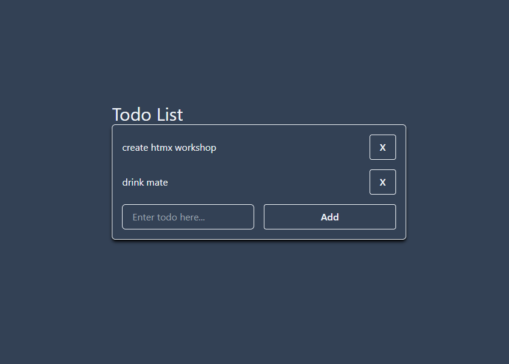
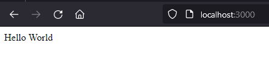
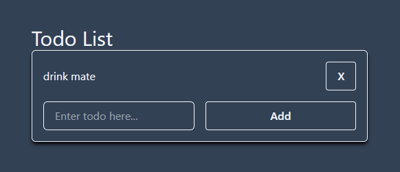
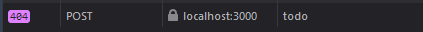
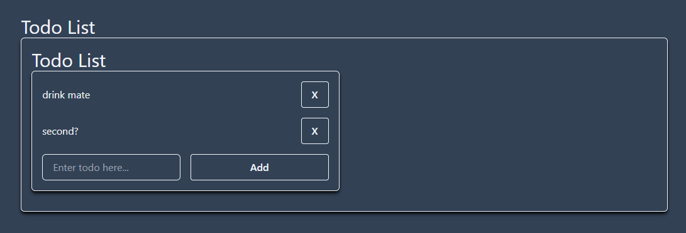

> # This is the final code. Head to the `template` branch to code along with an empty setup.

# htmx Go Template Workshop

This is a barebones example on how you can create a single-page application todo-list using htmx, Go with the templ library for templates in the backend, and tailwindcss for styling elements.

_Not a single line of javascript will be written._

What you'll be creating:



## Requirements

There are two ways you can code along:

- Fully use Docker.
- Download all the dependencies manually:

  - Go | [Install](https://go.dev/doc/install): The newer the better. The `go install` command requires Go >=1.18.
  - Templ | [Install](https://templ.guide/quick-start/installation): Used for generating Go code from templates.
    Can be installed as follows:

    ```sh
    go install github.com/a-h/templ/cmd/templ@latest # install via go
    curl -SLO https://github.com/a-h/templ/releases/download/v0.2.432/templ_Linux_x86_64.tar.gz # install binary
    nix develop . # installs all required dependencies
    ```

  - Air | [Install](https://github.com/cosmtrek/air#installation): Allows for hot-reloading the webserver on save.

    ```sh
    go install github.com/cosmtrek/air@latest
    curl -sSfL https://raw.githubusercontent.com/cosmtrek/air/master/install.sh # then execute the sh script
    nix develop .
    ```

  - Go dependencies: Execute `go get .` while in this directory.

## Starting the webserver

How the server is to be started depends on if you went the Docker or manual route:

- Docker: `docker compose up --build`
- Manual: `air`

The website will now be accessible at http://localhost:3000.

## Helpful extensions for your editor

These are some optional and helpful extensions to improve your coding experience with the tech stack:

- TailwindCSS [Intellisense]
  - Additionally add `templ` to the tailwind config so that it runs in templ files.
    Vscode JSON User Settings as an example:
    ```json
    "tailwindCSS.includeLanguages": {
      ...
      "templ": "html"
    }
    ```
- templ[-vscode]
- Go

# Workshop

## What is htmx?

[htmx](https://htmx.org/)' motto is to stay simple. Instead of throwing huge chunks of javascript at a user, we only work with the actual required html. Using htmx we can make buttons responsive and replace elements on the website without reloading the website. The basics are, that when we click a button that should modify the site, we send a request to the backend server. The backend then doesn't return JSON, but the direct HTML which will be used to place wherever defined.

## Base project layout

### Go

This project has a small amount of Go code. `main.go` is the whole webserver. For handling requests we use [chi](https://github.com/go-chi/chi) which is a lightweight http library. It allows for some nice features like easily adding middlewares and getting values from routes.

The other file is `internal/todo_type.go` and this file only defines a single type definition. Go doesn't allow for circular dependencies and we need it in both main.go and the templ templates.

### Templ

We're building a template driven webserver (similar to Django). Go has a template library out of the box (`template/html`), but it is not as clean as it could be. Instead for this project we'll be using [templ](https://templ.guide/). Templ goes in the direction of components, similar to React. Like in the code snippet below, we can easily create a component (like `Hello`) and then easily use that wherever we want (using `@Hello()`). This gives a lot of freedom for how to use our components and it allows for a very clear structuring of the website. The syntax is also basically Go (with the same types), but we sprinkle in some html. Templ will generate Go code which then can be imported in `main.go`. It is important to make sure the generation runs and works.

```go
package main

templ Hello(name string) {
  <div>Hello, { name }</div>
}

templ Greeting(person Person) {
  <div class="greeting">
    @Hello(person.Name)
  </div>
}
```

### Tailwindcss

For styling everything, we use [Tailwindcss](https://tailwindcss.com/). It's a must-have for designing a website. It allows you to more easily write and use css. For this project, most of the tailwindcss should already be added to components though, so you don't really have to touch it.

# Code along workshop

## Part 1: Getting familiar with templates

1. Quick explanation of the structure of `main.go`. Currently the website is running, but we haven't defined any routes.
2. Introduce `components/base.templ`. htmx and tailwindcss are installed in the \<head\>. Using tailwind we set the bg to dark, text to white and create a div which fully centers all its items. The `{ children... }` tag allows the Base template to surround any other components we want.
3. Introduce `todo.templ`. We can now add the route to have our server show that component:

   ```go
   // Handles all GET requests to /
   r.Get("/", templ.Handler(components.Index()).ServeHTTP)
   ```

   Now visit `http://localhost:3000` and you'll see "Hello World".

   

4. We're missing the dark background though. Our Base is missing! Let's add that:
   ```go
   templ Index() {
       @Base() {
           <p>
               Hello World
           </p>
       }
   }
   ```
5. Let's create our todo-list:

   ```go
   // The list of all todos. Basically the whole page functionality
   templ TodoList() {
       <div id="todo-list" class="flex flex-col">
           <h1 class="text-3xl">Todo List</h1>
           <form
               class="grid grid-cols-2 border border-slate-100 rounded-md p-4 shadow-black shadow-md gap-4"
           >
               <p>
                   First Todo
               </p>
           </form>
       </div>
   }
   ```

   Then update the `Index()` component to use the `TodoList` template:

   ```go
   templ Index() {
       @Base() {
           @TodoList()
       }
   }
   ```

6. Let's add a component for a single todo item. There's a lot of styling on the button, you can also just copy it over.

   ```go
   // A single todo item
   templ todoItem() {
       <p class="w-full self-center">
           Todo text placeholder
       </p>
       <div class="flex justify-end">
           <button
               type="button"
               class="bg-transparent text-slate-100 font-semibold py-2 px-4 border border-slate-100 rounded hover:bg-slate-100 hover:text-black active:bg-slate-300 active:text-slate-700"
           >
               X
           </button>
       </div>
   }
   ```

   Then update the TodoList to use a few of these components:

   ```go
   templ TodoList() {
       <div id="todo-list" class="flex flex-col">
           <h1 class="text-3xl">Todo List</h1>
           <form
               class="grid grid-cols-2 border border-slate-100 rounded-md p-4 shadow-black shadow-md gap-4"
           >
               @todoItem()
               @todoItem()
           </form>
       </div>
   }
   ```

7. Okay it looks good. Now comes a big step. Let's make the components use some variables we can pass in. For this we'll use the `internal.Todo` struct defined in `internal/todo_type.go`.
   1. Create a todo array in `main.go`:
      ```go
      import "coding-weekend/internal" // add import
      ...
      var todos = []internal.Todo{} // all todos are stored in a global array
      ...
      func main() {...
      ```
   1. Import the same in `todo.templ` at the top:
      ```go
      import "coding-weekend/internal"
      ```
   1. Adjust `todoItem` to take a todo as argument:
      ```go
      templ todoItem(todo internal.Todo) {...
      ```
   1. Adjust `TodoList` to take an array of todos as argument:
      ```go
      templ TodoList(todos []internal.Todo) {...
      ```
   1. Adjust `Index` to also take an array of todos as argument and pass it to `TodoList`:
      ```go
      templ Index(todos []internal.Todo) {
          @Base() {
              @TodoList(todos)
          }
      }
      ```
      We won't be touching this `Index` component anymore.
   1. Update our route handler in `main.go` to pass in the created todo array:
      ```go
      r.Get("/", templ.Handler(components.Index(todos)).ServeHTTP)
      ```
   1. Last step is to modify our `TodoList` to create a `todoItem` for every todo. For this we add a Go for-loop:
      ```go
      templ TodoList(todos []internal.Todo) {
          <div id="todo-list" class="flex flex-col">
              <h1 class="text-3xl">Todo List</h1>
              <form
                  class="grid grid-cols-2 border border-slate-100 rounded-md p-4 shadow-black shadow-md gap-4"
              >
                  for _, t := range todos { // IMPORTANT: the first value (underscore) is the index in Go. We can ignore it
                      @todoItem(t)
                  }
              </form>
          </div>
      }
      ```
8. All errors should be gone now. Let's finish `todoItem` by making it actually use the passed in todo struct:
   ```go
   templ todoItem(todo internal.Todo) {
       <p class="w-full self-center">
           { todo.Text } // add this
       </p>
       ...
   ```
9. Now when we visit the site, we have an empty todo list. Let's add some mock data in `main.go` to our todo list:
   ```go
   var todos = []internal.Todo{
       {Text: "drink mate"},
   }
   ```
   Yay, if we visit our site we now have our first dynamic todo there.
10. We need a way to add new todos. Let's add an input field with a submit button. We create a new component for that in `todo.templ`. The button styling is again quite big, so just copy paste it :)

    ```go
    // The input field for adding new todos
    templ todoInput() {
        <input
            placeholder="Enter todo here..."
            name="text"
            type="text"
            class="w-full h-full bg-transparent border border-slate-100 rounded-md py-2 px-4"
            required
        />
        <button
            type="submit"
            class="bg-transparent h-full text-slate-100 font-semibold py-2 px-4 border border-slate-100 rounded hover:bg-slate-100 hover:text-black active:bg-slate-300 active:text-slate-700"
        >
            Add
        </button>
    }
    ```

    Then below our for loop in `TodoList` add the input component:

    ```go
    ...
        for _, t := range todos {
                @todoItem(t)
            }
        @todoInput() // add this
    </form>
    ...
    ```

    We won't be touching this `todoInput` anymore.

We can now visit our site and we'll see the following. This concludes all the base templating we'll be doing. When you click a button nothing really happens right now except that the site refreshes. In the second part we'll look into how to make it actually dynamic and function correctly using htmx.



### [Short break here]

## Part 2: Making the site dynamic using htmx

1. The first thing we'll look at is adding new todos when we click "Add". You might have noticed we're using a form. By creating a form we can define the different input fields we want which will then be returned as values in a POST request using htmx.

   > For the next steps to work, make sure you have `name="text"` in the `todoInput()` text input. This will be they key for getting the value out of the POST body in the backend.

   Head to `TodoList` where we have the \<form\> and add the following `hx-post` tag:

   ```go
   templ TodoList(todos []internal.Todo) {
       ...
           <form
               class="grid grid-cols-2 border border-slate-100 rounded-md p-4 shadow-black shadow-md gap-4"
               hx-post="/todo" // add this
           >
       ...
   }
   ```

   This basically says, "send post request to /todo with the form values on submit". If you try and add an item now, you'll notice the website doesn't reload anymore, but in the networks tab we get a 404:

   

2. Head back to `main.go` and we'll implement the handling of the POST method now. Basically, we want to parse the form values and get the "text" value out.

   ```go
   // Handles all POST requests to /todo made by htmx
   r.Post("/todo", func(w http.ResponseWriter, r *http.Request) {
   	r.ParseForm() // REQUIRED for the r.PostFormValue to get filled with values
   	text := r.PostFormValue("text")
   	log.Printf("text = %s", text)
   })
   ```

   Let's add a new todo on the website. If the website seems to just disappear, it's all working as intended. We should also see our text being printed in the console.

3. The site seems to disappear because htmx is by default expecting us to return the new html. In that case, lets update our todos list with the new todo and return the required html for the todo list:

   ```go
   r.Post("/todo", func(w http.ResponseWriter, r *http.Request) {
   	r.ParseForm() // REQUIRED for the r.PostFormValue to get filled with values
   	text := r.PostFormValue("text")

   	todos = append(todos, internal.Todo{Text: text}) // update todos list with new todo

   	templ.Handler(components.TodoList(todos)).ServeHTTP(w, r) // write html result
   })
   ```

4. Okay this is confusing, what is happening when I click the submit button?

   

   That is because by default htmx replaces the inner HTML of the component that sent the request. Meaning when we submit, the outer form that sent the request will stay, but it'll replace all its contents inside with the result of our `r.Post` function above. Let's fix that by simply swapping out the whole Todolist with the new content.

   > Note the `id="todo-list"` on the outer most div inside `templ TodoList`.

   We do that by adding the `hx-target="#todo-list"` to have it target our whole todo list and `hx-swap="outerHTML"` to make it replace the full target, instead of simply the contents inside. Here's how our `TodoList` looks now:

   ```go
   templ TodoList(todos []internal.Todo) {
       <div id="todo-list" class="flex flex-col">
           <h1 class="text-3xl">Todo List</h1>
           <form
               class="grid grid-cols-2 border border-slate-100 rounded-md p-4 shadow-black shadow-md gap-4"
               hx-post="/todo"
               hx-target="#todo-list"
               hx-swap="outerHTML"
           >
               for _, t := range todos {
                   @todoItem(t)
               }
               @todoInput()
           </form>
       </div>
   }
   ```

   With this we can now add new todos and it works without refreshing the whole page.

   `TodoList` is also fully done now. We won't be touching it anymore.

5. We now have the problem, that when we refresh the page, we suddenly only have our base example of `drink mate`. That is because our current `r.Get("/")` route only creates the template once when we start up the Go application. Let's fix that by making it recreate the template on each request:

   ```go
   r.Get("/", func(w http.ResponseWriter, r *http.Request) {
   	templ.Handler(components.Index(todos)).ServeHTTP(w, r)
   })
   ```

   Refreshing the page now gives us the correct list of todos.

6. We have almost everything done already. We just need a way to clean up todos now. For that we want to have it so clicking on the `X` button sends a delete request to `/todo/{id}` with the correct todo ID. The backend then deletes the correct ID and sends back the correct html for the todo list. Theoretically htmx allows you to delete html elements, but to keep it simple we'll be replacing the whole todo list.

   Just as before, set `hx-target="#todo-list"` to have it target the whole todo list and `hx-swap="outerHTML"` to have it replace the whole target. To have htmx create a DELETE request, we'll use `hx-delete` and we use Go's `fmt` library to make an url using the todo ID:

   ```go
   import "fmt"
   ...

   templ todoItem(todo internal.Todo) {
       <p class="w-full self-center">
           { todo.Text }
       </p>
       <div class="flex justify-end">
           <button
               type="button"
               class="bg-transparent text-slate-100 font-semibold py-2 px-4 border border-slate-100 rounded hover:bg-slate-100 hover:text-black active:bg-slate-300 active:text-slate-700"
               hx-delete={ fmt.Sprintf("/todo/%d", todo.ID) }
               hx-target="#todo-list"
               hx-swap="outerHTML"
           >
               X
           </button>
       </div>
   }
   ```

   All our components are now fully done. We won't have to modify them anymore.

7. Time to add the delete handler in `main.go`. Chi allows us to have arbitrary routes using regex. Here we only listen to routes of the form `/todo/{id}` where id is some number. We then convert the string parameter from the URL into an int and using `slices.DeleteFunc` we iterate over our todos array and delete all the elements that match the given ID.

   ```go
   // Handles all DELETE requests to /todo/{id} where id is some number
   r.Delete("/todo/{id:\\d+}", func(w http.ResponseWriter, r *http.Request) {
   	// make sure the argument is a valid int (not too large for example)
   	id, err := strconv.Atoi(chi.URLParam(r, "id"))
   	if err != nil {
   		http.Error(w, "invalid id", http.StatusBadRequest)
   		return
   	}
   	todos = slices.DeleteFunc[[]internal.Todo](todos, func(t internal.Todo) bool {
   		return t.ID == id
   	})
   	templ.Handler(components.TodoList(todos)).ServeHTTP(w, r)
   })
   ```

8. Last course of action. We have to add a unique ID to each todo. We'll be doing this very simply and not thread safe for simplicity sake.
   1. Add a `todoCounter` which we'll increase everytime a todo item is added. This is what we'll use for assigning IDs. Additionally remove the hardcoded example from the array.
      ```go
      var (
          todos       = []internal.Todo{} // all todos are stored in a global array
          todoCounter = 0                 // used for assigning todo ids
      )
      ```
   2. Add the ID to created todos in our `r.Post` function and increment the counter:
      ```go
      todos = append(todos, internal.Todo{Text: text, ID: todoCounter})
      todoCounter++
      ```

**The workshop is finished! Your site should now be in a working state where you can add and remove todo items.**

## Going further

Some basic ways you would make this site more production ready.

### User specific todo list

The site works as of now, but as soon as you start having more users, you'll quickly notice a problem: The todo list is shared by all users, since it's completely server side in a single slice. You'll then want to start looking into storing data on a per-user level. In the simplest terms this can be done by creating a map with the keys being a user's hostname and the value being their list of todos. [Gorilla sessions](https://github.com/gorilla/sessions) allow this to be implemented in a more secure way.

### Optimized tailwindcss

Currently we load all of tailwindcss which is already 100kB in transfer size alone. This is quite inefficient. Using the tailwind CLI tool we can build a custom css file which only defines the tailwind elements we're actually using. This is described in the [install](https://tailwindcss.com/docs/installation) section of tailwindcss. This reduces the css size to a few kilobytes.
